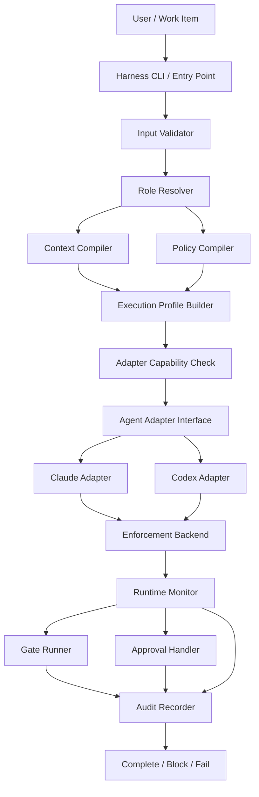

# Harness Implementation Architecture

## Document Status

| Field | Value |
|---|---|
| Status | Architecture Draft |
| Scope | Harness v0.1 technical design |
| Runtime Contract | `.ai/HARNESS_CONTRACT.md` |
| Implementation | Not started |

本文件只定義 Harness 的 implementation architecture，不是新的 Governance Authority，也不修改 `.ai/HARNESS_CONTRACT.md`。若本文件與 Constitution、Authority、Workflow、active role、active gate 或 Harness Contract 衝突，必須停止並依既有治理規則處理。

## 1. Design Goals

Harness architecture 必須具備：

- Vendor-neutral：核心不依賴單一 Agent vendor。
- Local-first：v0.1 在開發者本機與 repository checkout 執行，不要求常駐雲端服務。
- Repository-driven：work item、governance、specification、design contract 與 gate 都來自 repository。
- Least privilege：context、filesystem、tools、commands、environment 只開放任務最低需要。
- Auditable：每次 execution 都產生可核對的 context、policy、operation 與 gate evidence。
- Fail closed：無法驗證 input、context、policy 或 enforcement capability 時拒絕啟動或停止執行。
- Adapter-based：Claude、Codex 與未來 Agent 只負責轉譯 Execution Profile。
- Soft / hard enforcement 分離：prompt guidance 不可冒充安全邊界。
- Cross-platform aware：核心 schema 與 orchestration 跨平台；hard enforcement 由可驗證的 backend capability 提供。

Claude Code 與 Codex 是 v0.1 adapters。Gemini、Hermes、Copilot 可在未來透過相同 interface 擴充，但任何 vendor-specific adapter 都不得成為 Governance 或 Specification Source of Truth。

## 2. High-Level Architecture



核心原則：

- Core components 產生 vendor-neutral artifacts。
- Adapter 只能降低或忠實映射權限，不能修改 compiled policy。
- Enforcement Backend 必須在 Agent process 外部或由不可被 Agent 改寫的 vendor / OS enforcement surface 提供。
- Runtime Monitor 是偵測與協調層，不取代 hard enforcement。
- Audit Recorder 使用 Agent 不可寫入的 host-owned storage。

### 2.1 Component Responsibilities

| Component | Responsibility | Input | Output | Dependencies | Failure Behavior |
|---|---|---|---|---|---|
| Harness CLI / Entry Point | 接收 task 與 adapter 選擇，建立 execution | CLI args、cwd、environment | Invocation Request | Input Validator | 參數不完整時不啟動 Agent |
| Input Validator | 驗證 input schema、repo、branch、work item | Invocation Request | Validated Input | Git metadata、schema | `INVALID_INPUT`，fail closed |
| Role Resolver | 將 role ID 對應 active role，確認 work item 無越權 | Validated Input、work item | Resolved Role | `.ai/roles/**`、Authority | 無映射或矛盾時 `POLICY_BUILD_FAILED` |
| Context Compiler | 組出 least-context manifest | Role、feature、phase、work item | Execution Context Manifest | Governance、specs、design、source tree | 缺檔或衝突時 block / fail |
| Policy Compiler | 將治理與任務邊界交集化 | Governance、role、gate、work item、Contract | Execution Policy | Authority、Harness Contract | 無法證明權限時 deny / fail |
| Execution Profile Builder | 合併 context 與 policy，凍結正式執行輸入 | Context Manifest、Execution Policy | Execution Profile | Schema registry | Schema/hash 不一致時 fail |
| Agent Adapter Interface | 定義所有 vendor adapter 的共同 lifecycle | Execution Profile | Adapter Result / Events | Adapter implementation | capability 不足時拒絕 prepare |
| Claude Adapter | 將 profile 映射到 Claude Code surfaces | Immutable Execution Profile | Claude launch plan | Claude Code capabilities | 無法硬性映射時 fail closed |
| Codex Adapter | 將 profile 映射到 Codex surfaces | Immutable Execution Profile | Codex launch plan | Codex CLI / config capabilities | 無法硬性映射時 fail closed |
| Enforcement Backend | 實際限制 filesystem、tools、commands、env | Compiled Policy、adapter capability | Enforced process boundary | Vendor sandbox / OS controls | 不可驗證時不 launch |
| Runtime Monitor | 消費 events、比對 policy、觸發 stop / approval | Runtime events、policy | Normalized Events、violations | Adapter、Enforcement Backend | violation 時 terminate / block |
| Gate Runner | 依 phase orchestration required gates | Artifacts、gate docs、evidence | Gate Results | `.ai/gates/**`、Reviewer / validators | failed gate 進入 `FAILED_GATE` |
| Audit Recorder | 記錄 execution facts 與 hashes | 所有 normalized events | Audit Event Stream、Final Record | Host-owned state store | audit 不可寫時不得開始 execution |
| Approval Handler | 管理 restricted operation 的人工決策 | Approval Request、policy hash | Approval Decision | Human channel、Audit Recorder | deny / timeout 時不執行 operation |

## 3. Execution Flow

| Step | Action | Lifecycle Before | Lifecycle After | Failure Route |
|---|---|---|---|---|
| 1 | User / Work Item 啟動 Harness | None | `CREATED` | `INVALID_INPUT` |
| 2 | Validate Input、repo、branch、work item | `CREATED` | `CREATED` | `FAILED_RUNTIME` |
| 3 | Resolve active role 與 phase | `CREATED` | `CREATED` | `POLICY_BUILD_FAILED` |
| 4 | Load mandatory Governance | `CREATED` | `CREATED` | `CONTEXT_BUILD_FAILED` |
| 5 | Compile least Context Manifest | `CREATED` | `CREATED` | Spec gap / conflict / context failure |
| 6 | Compile filesystem、tool、command policy | `CREATED` | `CREATED` | `POLICY_BUILD_FAILED` |
| 7 | Build and hash Execution Profile | `CREATED` | `CONTEXT_READY` | `FAILED_RUNTIME` |
| 8 | Select adapter and verify capabilities | `CONTEXT_READY` | `CONTEXT_READY` | `ADAPTER_FAILED` |
| 9 | Apply hard boundary and launch Agent | `CONTEXT_READY` | `RUNNING` | `ADAPTER_FAILED` |
| 10 | Send context and monitor runtime | `RUNNING` | `RUNNING` | Runtime violation / stop condition |
| 11 | Collect result and validate output scope | `RUNNING` | `VALIDATING` | `RUNTIME_VIOLATION` |
| 12 | Execute required gates | `VALIDATING` | `VALIDATING` | `FAILED_GATE` |
| 13 | Finalize immutable audit record | `VALIDATING` | `COMPLETED` | `FAILED_RUNTIME` |

完整 sequence：

```text
User / Work Item
→ Harness Start
→ Validate Input
→ Resolve Role
→ Load Governance
→ Compile Context
→ Compile Permissions
→ Build Execution Profile
→ Select Agent Adapter
→ Verify Adapter Capabilities
→ Apply Enforcement Boundary
→ Launch Agent
→ Monitor Runtime
→ Validate Output
→ Execute Required Gates
→ Write Audit Evidence
→ Complete / Block / Fail
```

`COMPLETED` 只能在 required gates 通過、audit finalized 且沒有未處理 stop condition 時產生。

## 4. Input Model

### 4.1 Conceptual CLI

完整形式：

```text
harness run \
  --task PBI-INV-003 \
  --role IMPLEMENTER \
  --feature inventory \
  --agent codex
```

v0.1 建議形式：

```text
harness run --task PBI-INV-003 --agent codex
```

Harness 應從目前 repository 與 `work-items/PBI-INV-003.md` 取得：

- `task_id`：work item metadata 與檔名一致性驗證。
- `role`：work item `Role`。
- `feature`：work item 明確 metadata。
- `phase`：work item 明確 metadata。
- `work_item`：由 task ID canonical resolution。
- `repository`：Git remote / repository identity。
- `branch`：目前 checkout branch。
- `spec_version`、`design_version`：work item metadata。
- `read_scope`、`write_scope`、`forbidden_scope`、`required_gates`：Work Item canonical sections。

CLI 提供的重複欄位只能用於 assertion，不得覆蓋 work item。若 `--role`、`--feature` 或 `--branch` 與 repository facts 不一致，Input Validator 必須 fail closed。

### 4.2 Canonical Work Item Schema

`templates/Work_Item.md` 是唯一 canonical Work Item schema，已明確定義 Metadata、Requirement References、task-specific scopes、Acceptance Criteria、Required Gates、Dependencies、Blockers 與 validation rules。

- Harness 必須直接解析 Work Item 的 `ID`、`Role`、`Feature`、`Phase`、`Status`、`Spec Version` 與 `Design Version`。
- `task_id`、Metadata `ID` 與 `<ID>.md` filename 必須一致。
- Harness 不得從 ID prefix、Title、filename、directory 或 Agent assumption 猜測 `Role`、`Feature` 或 `Phase`。
- Work Item scope 只能縮小 active role boundary；effective permission 由 Governance、Role、Work Item 與 Host Baseline 取交集。
- `Forbidden Scope` 永遠優先於 `Write Scope`。
- Parser、validator 與 adapter 不得另建 enum、section name 或 Work Item schema。

Work Item Status 與 Harness execution lifecycle 是不同狀態機；runtime 不得以 `IN_PROGRESS`、`DONE` 等 Work Item Status 取代 `RUNNING`、`COMPLETED` 等 execution state。

## 5. Context Compiler Architecture

Context Compiler 產生 immutable `Execution Context Manifest`：

```yaml
schema_version: harness.context/v1
execution_id: string
task_id: string
role: string
feature: string
phase: string
governance_context:
  - path: string
    sha256: string
delivery_context:
  - path: string
    sha256: string
source_context:
  - path: string
    sha256: string
design_context:
  - path: string
    sha256: string
work_item:
  path: string
  sha256: string
context_hash: string
spec_versions:
  feature: string
  design: string
excluded_context:
  - path: string
    reason: string
```

### 5.1 Context Classes

| Class | Definition | Inclusion Rule |
|---|---|---|
| Mandatory | Constitution、Authority、Workflow、active role、active gate、assigned work item | 缺少即停止 |
| Conditional | 與 role、feature、phase、screen、gate 直接相關的 specs / design / source | 有追溯關係才加入 |
| Optional | 使用者明確提供且在 read boundary 內的 additional context | 必須記錄原因與 hash |
| Excluded | 與任務無關、越界、敏感或被 deny 的內容 | 記錄 path pattern 與原因，不載入內容 |

### 5.2 Least Context Algorithm

1. 由 mandatory governance 建立基底。
2. 從 work item 解析 requirement、feature、screen、spec version 與 required gates。
3. 沿 traceability links 選取直接相關 delivery artifacts。
4. 依 role 加入必要 source / design context。
5. 將 additional context 與 read policy 取交集。
6. 排除 deny、敏感、無關或版本不符項目。
7. 對每個檔案計算 SHA-256，依 normalized relative path 排序。
8. 對 canonical manifest 計算 `context_hash`。

Context Compiler 不得把「整個 repo 都可能有用」當成載入理由。無法確定必要性時先排除；若因此缺少 required context，回報 `MISSING_REQUIRED_CONTEXT`。

## 6. Policy Compiler

Policy Compiler 的 inputs：

```text
CONSTITUTION
AUTHORITY
WORKFLOW
active role
active gate
assigned work item
HARNESS_CONTRACT
host environment baseline
```

輸出為 immutable `Execution Policy`：

```yaml
schema_version: harness.policy/v1
policy_hash: string
sources:
  - path: string
    sha256: string
filesystem:
  read: []
  write: []
  deny_write: []
tools:
  allow: []
  deny: []
commands:
  safe_read: []
  development_write: []
  restricted: []
environment:
  allowed: []
approval_required:
  operations: []
```

Compilation semantics：

- Allowed capability = Governance ∩ Active Role ∩ Work Item ∩ Host Baseline。
- Denied capability = 所有來源 deny 的聯集；deny 永遠優先。
- CLI request 與 adapter capability 只能縮小，不能擴張 compiled allow set。
- 未明確允許的 filesystem write、tool、command 與 environment variable 預設拒絕。
- Policy source hash 變更後，舊 Execution Profile 立即失效，必須重新 compile。
- 任何互相矛盾且無法由 Authority 解決的 policy input 產生 `SPEC_CONFLICT` 或 `POLICY_BUILD_FAILED`。

## 7. Execution Profile

Execution Profile 是 Harness Core 與 Agent Adapter 之間的唯一正式 runtime contract：

```yaml
schema_version: harness.execution-profile/v1
profile_hash: string
execution:
  execution_id: string
  task_id: string
  role: string
  feature: string
  phase: string
  adapter: claude | codex
repository:
  identity: string
  root: string
  branch: string
  commit_before: string
context:
  manifest_ref: string
  context_hash: string
filesystem:
  read: []
  write: []
  deny_write: []
tools:
  allow: []
  deny: []
commands:
  safe_read: []
  development_write: []
  restricted: []
environment:
  allowed: []
gates:
  required: []
audit:
  execution_sink: string
  redaction_policy: string
  required_fields: []
```

Profile Builder 必須：

- 驗證 Context Manifest 與 Policy hashes。
- 產生 deterministic canonical representation 與 `profile_hash`。
- 將 profile 設為 immutable；任何修改都建立新 execution。
- 不放入 secret value，只放入允許的 secret reference identifier。

## 8. Agent Adapter Interface

Language-neutral interface：

```text
prepare(profile) -> capability_report | adapter_error
apply_permissions(profile) -> enforcement_plan | adapter_error
launch(profile, enforcement_plan) -> session_handle | adapter_error
send_context(session_handle, context_manifest) -> accepted | adapter_error
monitor(session_handle) -> normalized_event_stream
terminate(session_handle, reason) -> termination_result
collect_result(session_handle) -> adapter_result
```

Adapter invariants：

- Input Execution Profile 為 immutable。
- Adapter 不得修改 governance、compiled policy 或 context hash。
- Adapter 不得擴張 filesystem、tool、command、environment boundary。
- Adapter 不得自行忽略 Stop Condition 或 Gate failure。
- `prepare()` 必須產生 capability report，逐項說明 soft / hard / unsupported。
- Critical hard boundary 若為 unsupported，Adapter 必須拒絕 `launch()`。
- Vendor events 必須正規化後交給 Runtime Monitor 與 Audit Recorder。

## 9. Claude Adapter Design

Claude Adapter 未來可將 Execution Profile 映射到：

| Profile Concern | Claude Surface | Enforcement Level |
|---|---|---|
| Repository guidance | `CLAUDE.md` 與明確 context package | Soft |
| Tool allow / deny | Claude Code permission allow / ask / deny rules | Hard-capable vendor control |
| Read / edit scope | Permission path rules與 Claude sandbox capability | Hard-capable，需 capability check |
| Command interception | `PreToolUse` / permission hooks | Hard-capable only when host-controlled |
| Approval request | Permission prompt或 SDK approval callback | Human control |
| Working directory | Adapter child process cwd | Process boundary |
| Context files | Adapter explicit context injection | Soft context delivery |
| Runtime events | Headless / SDK event stream | Audit / monitoring |

Design rules：

- `CLAUDE.md` 只提供 guidance，不可單獨承擔 `deny_write`。
- Claude permission evaluation 的 deny 規則必須優先於 allow；v0.1 不使用 bypass permission mode。
- Hooks 若用於 blocking，設定與 hook executable 必須位於 Agent 不可寫入的 host-controlled location。
- Permission / hook mapping 必須再由外層 filesystem、environment 與 credential isolation 防禦。
- Adapter 不得把 `allowedTools` 誤當完整 allowlist；未列出的工具仍需由 deny / mode / callback 明確處理。
- 本階段不建立 `.claude/settings.json`、hooks 或 SDK code。

## 10. Codex Adapter Design

Codex Adapter 未來可將 Execution Profile 映射到：

| Profile Concern | Codex Surface | Enforcement Level |
|---|---|---|
| Repository guidance | `AGENTS.md` 與 explicit context | Soft |
| Filesystem boundary | Codex permission profile或 sandbox configuration | Hard-capable vendor / OS control |
| Approval policy | `approval_policy` / CLI approval option | Human control |
| Restricted commands | Exec policy、hooks、sandbox escalation | Hard-capable when host-controlled |
| Working directory | `codex exec` cwd / project root | Process boundary |
| Context files | Explicit prompt/context package，不只依賴自動 `AGENTS.md` discovery | Soft context delivery |
| Runtime events | `codex exec --json` JSONL stream | Audit / monitoring |
| Structured result | Output schema / final result collection | Validation aid |

Design rules：

- v0.1 優先採 non-interactive `codex exec` 作為可監控 child process interface。
- Adapter 必須明確設定最小 sandbox / permission profile 與 approval policy，不依賴使用者全域預設。
- Project trust 會影響 project-local config、hooks 與 rules 是否載入；`prepare()` 必須驗證實際 effective capability。
- Harness enforcement config 必須由 host-controlled source 提供，不能放在 Agent 可寫路徑後期待 Agent 自律。
- `AGENTS.md` 有載入容量與 scope，Context Compiler 必須明確送入必要 context，不能假設所有 reference 都自動進入 model context。
- Full access / bypass sandbox 不可作為 v0.1 的正常 profile。
- 本階段不建立 `.codex/config.toml`、permission profile、hook 或 launch code。

## 11. Runtime Enforcement

### 11.1 Soft Enforcement

Soft enforcement 用於意圖、角色、任務與規格說明：

- Prompt。
- `AGENTS.md`。
- `CLAUDE.md`。
- Context Package。
- Work Item。
- Gate instructions。

Soft enforcement 可以降低誤解，但 Agent 可能忽略、誤讀或遭 prompt injection 影響，因此不能作為安全邊界。

### 11.2 Hard Enforcement

Hard enforcement 必須由 Agent 無法自行改寫的機制提供：

- Vendor / OS filesystem sandbox。
- Host-controlled permission profile與 deny rules。
- Host-controlled command / tool interception。
- Process isolation 與 child process termination。
- Environment allowlist 與 secret omission。
- 不向 session 注入 production deployment、database 或 credential tools。
- Audit sink 位於 Agent write boundary 外。

以下邊界不得只依賴 prompt：

| Boundary | Required Hard Control |
|---|---|
| `deny_write` | Sandbox / permission profile 阻止 write；diff monitor 僅作 defense-in-depth |
| Credential access | 不注入 secret、env allowlist、host credential isolation |
| Production deployment | 不提供 production credential / deployment tool，必要時人類批准後建立新 context |
| Destructive commands | Command interception + sandbox / tool deny，禁止單靠文字提醒 |

### 11.3 Enforcement Capability Negotiation

每個 adapter 在 `prepare()` 必須回報：

```yaml
filesystem_deny_write: hard | soft | unsupported
tool_deny: hard | soft | unsupported
command_interception: hard | soft | unsupported
environment_filtering: hard | soft | unsupported
credential_isolation: hard | soft | unsupported
runtime_events: complete | partial | unavailable
termination: supported | unsupported
```

Critical boundary 只要回報 `soft` 或 `unsupported`，Execution Profile 不得啟動。Runtime Monitor 的 pre/post diff、event inspection 與 output validation 只能作第二道防線。

## 12. Gate Runner

Gate Runner interface：

```text
resolve_required_gates(profile) -> gate_plan
load_gate_definition(gate_id) -> gate_definition
prepare_gate_context(profile, artifacts, audit) -> gate_context
execute_gate(gate_context) -> gate_result
record_gate_result(gate_result) -> audit_reference
```

Orchestration mapping：

| Phase | Default Gate ID | Gate Source |
|---|---|---|
| `SPEC` | `SPEC_GATE` | `.ai/gates/spec-gate.md` |
| `DESIGN` | `DESIGN_GATE` | `.ai/gates/design-gate.md` |
| `IMPLEMENTATION` | `IMPLEMENTATION_GATE` | `.ai/gates/implementation-gate.md` |
| `RELEASE` | `RELEASE_GATE` | `.ai/gates/release-gate.md` |
| `REVIEW` | Work Item 明確指定 | 依被審查 artifact phase 解析；不得自行推測 |

Mapping 與 enum 的 canonical definition 來自 `templates/Work_Item.md`。Required Gates 可以增加 Gate，但不能移除 Governance / Workflow 強制要求的 Gate。

Gate Runner 不重新定義 criteria。未來 validator 可以是 deterministic checks、Reviewer Agent 或 human review，但都必須輸出統一結果：

```yaml
gate_id: string
status: Pass | Failed | Needs Clarification
definition_hash: string
evidence: []
findings: []
reviewer: string
```

本階段不實作 validator。

## 13. Audit Architecture

Audit Recorder 採 event stream + final record：

```text
Host-owned State Directory
  executions/<execution-id>/
    execution-profile.json
    context-manifest.json
    execution-policy.json
    events.jsonl
    gate-results.json
    final-record.json
```

以上只是 placement design，不在本次建立目錄。

Audit requirements：

- State directory 位於 Agent writable repository 之外。
- 每個 event 包含 execution ID、sequence、timestamp、type、sanitized payload 與前一事件 hash。
- Final record 包含 Harness Contract 要求的 metadata、commands、tools、file changes、blocked operations、approvals、gates 與 final status。
- Context、policy、profile 與 gate definition 都記錄 content hash。
- Command 與 tool payload 在寫入前遮罩 secret、token、credential 與敏感環境值。
- Agent session 只拿到 write-only event channel 或由 parent process觀察，不取得 audit storage filesystem path。
- Audit write / flush 失敗時 fail closed；不能在無 evidence 狀態下繼續。

v0.1 的 hash chain 提供 tamper evidence，不宣稱等同外部 WORM storage。遠端簽章、集中式 audit service 與法規級保存屬後續版本。

## 14. Human Approval Architecture

至少需要人工批准：

- Production deployment。
- Force push / history rewrite。
- Destructive database operation。
- Credential-sensitive operation。
- Governance modification。

Approval lifecycle：

```text
REQUESTED
→ APPROVED
→ operation executes once
```

或：

```text
REQUESTED → REJECTED
REQUESTED → EXPIRED
```

Approval Request 必須綁定：

```yaml
approval_id: string
execution_id: string
policy_hash: string
operation_class: string
normalized_operation: string
resource: string
requested_by: string
requested_at: string
expires_at: string
```

- Approval 只允許完全相同的 operation 一次；參數、resource、policy hash 或 execution 改變即失效。
- Agent Adapter、Runtime Monitor 與 Reviewer Agent 都不能自行產生 `APPROVED`。
- Approval decision 與執行結果都必須寫入 audit。
- v0.1 可使用 local terminal prompt，但本文件不實作 UI。

## 15. Failure Model

| Failure | Detection Stage | Lifecycle Mapping | Required Behavior |
|---|---|---|---|
| `INVALID_INPUT` | Input Validator | `CREATED → FAILED_RUNTIME` | 不載入 Agent |
| `CONTEXT_BUILD_FAILED` | Context Compiler | `CREATED → FAILED_RUNTIME` | 記錄缺失與原因；若是 spec gap / conflict 改走專用 blocked state |
| `POLICY_BUILD_FAILED` | Policy Compiler | `CREATED → FAILED_RUNTIME` 或 `BLOCKED_PERMISSION` | 無法證明 allow 即 deny |
| `ADAPTER_FAILED` | prepare / launch / event collection | `CONTEXT_READY` 或 `RUNNING → FAILED_RUNTIME` | 終止 child process |
| `RUNTIME_VIOLATION` | Enforcement / Runtime Monitor | `RUNNING → BLOCKED_PERMISSION` | 阻擋 operation、終止受影響 execution |
| `SPEC_GAP` | Compiler、Agent、Gate | `→ BLOCKED_SPEC_GAP` | CR 流程與新 execution |
| `SPEC_CONFLICT` | Compiler、Agent、Gate | `→ BLOCKED_SPEC_CONFLICT` | 依 Authority 回報衝突 |
| `GATE_FAILED` | Gate Runner | `VALIDATING → FAILED_GATE` | 保存 evidence，不得 complete |
| `APPROVAL_DENIED` | Approval Handler | `RUNNING → CANCELLED`，若 operation 可選則維持 `RUNNING` | operation 絕不執行 |

所有 failure 都必須先記錄 audit 再回傳；若 Audit Recorder 本身失敗，parent process 立即終止 Agent。

## 16. Repository Placement Proposal

未來實作可能採：

```text
harness/
  package.json
  tsconfig.json
  src/
    cli/
    core/
    input/
    roles/
    context/
    policy/
    profiles/
    adapters/
      claude/
      codex/
    enforcement/
    runtime/
    gates/
    audit/
    approvals/
    security/
  schemas/
  tests/
    unit/
    contract/
    integration/
```

Placement rules：

- `harness/` 是 Framework 的未來 implementation package，不是 target project artifact。
- Runtime state 與 audit 不放在 `harness/` 或 Agent writable repo。
- Adapter-specific config 由 profile 動態產生在 host-owned execution directory；不提交 vendor runtime secrets。
- 本次不建立任何上述目錄或檔案。

## 17. Technology Recommendation

### 17.1 Comparison

| Dimension | Python | Node.js / TypeScript |
|---|---|---|
| CLI development | 成熟，Typer / argparse 易用 | 成熟，Commander / native parsing 易用 |
| Process control | `subprocess` 穩定 | `child_process`、stream、AbortSignal 適合長執行與事件流 |
| Filesystem control | 標準庫完整 | 標準庫完整，適合 async event orchestration |
| YAML / Markdown parsing | PyYAML、markdown 生態成熟 | YAML、remark / unified AST 與 schema 工具成熟 |
| Claude integration | Python SDK 可用 | Claude Agent SDK / tool ecosystem 與 TS type mapping 自然 |
| Codex integration | 可包 CLI / JSONL | 可包 CLI / JSONL，亦容易對接 TypeScript SDK surfaces |
| Portability | 良好，但需管理 Python runtime / venv | 良好，單一 Node LTS runtime 與 package distribution 較直接 |
| Testing | pytest 非常成熟 | Vitest / Node test runner 適合 schema、stream、adapter contract tests |
| Maintenance | 簡潔，動態型別需額外 schema discipline | Static types 可讓 Manifest、Policy、Profile、Adapter contract 共用型別 |
| SI talent availability | 普遍 | 前後端與工具鏈人才普遍，較容易跨團隊維護 |
| Future orchestration | AI / data tooling強 | Event-driven adapters、JSON Schema、CLI orchestration 更貼近本架構 |

### 17.2 Decision

Harness Runtime 唯一推薦方案：**Node.js / TypeScript**。

理由：

- 本架構核心是長執行 child process、JSONL event stream、schema validation、adapter interface 與 immutable typed artifacts，而不是資料科學運算。
- TypeScript 可讓 Input、Context Manifest、Execution Policy、Execution Profile、Audit Event 與 Adapter capability 使用同一套型別與 schema，降低跨 adapter 漂移。
- Claude 與 Codex 的 CLI / SDK / JSON tooling 都容易由 Node parent process orchestration。
- SI 團隊通常可由既有前後端 TypeScript 人力共同維護，不需要額外維持 Python packaging 路線。

Python 不作為 Harness core 的第二套 runtime。未來若有 Python validator，只能透過明確 plugin / subprocess contract 接入，不能形成雙核心架構。

## 18. Security Model

| Risk | Architecture Control |
|---|---|
| Path traversal | Repository-relative path normalization；拒絕 `..`、absolute path 與 root escape |
| Symlink escape | 解析 realpath，確認 target 仍在允許 root；每次 write 前重新檢查 |
| Secret isolation | Secret 不進 context / audit；只在 host-controlled adapter 需要時以短生命週期 reference 提供 |
| Subprocess control | Parent process 建立、監控、timeout、signal 與 process-tree termination |
| Environment leakage | Environment allowlist；移除 token、cloud、SSH、package registry 與 production variables |
| Audit tampering | Host-owned storage、Agent 無 write、hash chain、final profile hash |
| Sandbox escape | Adapter capability negotiation；critical boundary unsupported 時拒絕 launch |
| Production credentials | 與 development execution 完全隔離；v0.1 不注入 production credentials |
| Tool escape | 未註冊 tool 不傳給 Agent；MCP / browser / DB / deployment 分別套用 allowlist |
| Prompt injection | External content 標示為 untrusted；不能修改 compiled policy；tools 仍受 hard boundary |

Security invariants：

- Agent process 不得取得 Harness state directory、policy source或 approval signing material 的 write access。
- Repository 內設定不能放寬 host baseline；只能縮小權限。
- Adapter / vendor sandbox 不足時不能以 Runtime Monitor 或 post-run diff 宣稱已硬性阻擋。
- Production credential isolation 與 audit redaction 必須在 launch 前完成。

## 19. Harness v0.1 Boundary

### Must Have

- TypeScript CLI entry point 與 Input Validator。
- Role Resolver：`PRODUCT_ARCHITECT`、`UX_DESIGNER`、`IMPLEMENTER`、`REVIEWER`。
- Context Compiler 與 hashed Execution Context Manifest。
- Policy Compiler 與 immutable Execution Policy。
- Execution Profile Builder。
- Claude Adapter 與 Codex Adapter。
- Adapter capability negotiation 與 fail-closed launch。
- Filesystem `read / write / deny_write` hard mapping。
- Tool / Command Policy 與 restricted operation blocking。
- Lifecycle 與所有 Harness Contract Stop Conditions。
- Host-owned Audit Recorder 與 final record。
- Gate orchestration interface for Spec / Design / Implementation / Release。
- Local Human Approval Handler for restricted operations。

### Should Have

- `harness dry-run` 類型的 profile / capability preview。
- Context、policy、profile JSON Schema validation。
- Adapter contract test suite 與 fake adapter。
- Audit redaction tests 與可攜式 evidence export。
- Context hash cache，僅作效能優化，不影響 correctness。
- Clear diagnostics for missing context、unsupported hard enforcement 與 policy intersection。

### Not in v0.1

- Production deployment automation。
- Production database operation。
- Docker / Kubernetes execution backend。
- GitHub Actions / CI integration。
- Cloud-hosted Harness control plane。
- Gemini、Hermes、Copilot adapters。
- GUI / web approval console。
- Distributed multi-agent scheduling。
- Automatic Change Request approval或 canonical spec modification。
- Remote WORM audit service或 compliance archive。

## 20. Validation Against Harness Contract

| Validation | Result |
|---|---|
| Vendor-neutral core | Claude / Codex 僅存在於 adapters |
| No new Authority | 本文件明確 subordinate to existing governance and contract |
| Context boundary | Context Manifest 定義 mandatory / conditional / optional / excluded |
| Filesystem / tool / command boundary | Policy Compiler 與 Enforcement Backend 均有定義 |
| Soft vs hard | 已分離，critical boundaries 要求 hard capability |
| Lifecycle / stop conditions | Execution Flow 與 Failure Model 已對應 |
| Audit evidence | Host-owned event stream、hash 與 final record |
| Gate orchestration | 讀取 `.ai/gates/**`，不重寫 criteria |
| No implementation | 本次只新增本 architecture 文件 |
| Single runtime recommendation | Node.js / TypeScript |
| MVP boundary | Must / Should / Not in v0.1 已定義 |

## 21. Official Capability References

以下文件只用於確認 adapter 可用的 vendor capability，不是 Governance Source of Truth：

- Codex Agent approvals & security: https://learn.chatgpt.com/docs/agent-approvals-security
- Codex permissions: https://learn.chatgpt.com/docs/permissions
- Codex non-interactive mode: https://learn.chatgpt.com/docs/non-interactive-mode
- Codex AGENTS.md: https://learn.chatgpt.com/docs/agent-configuration/agents-md
- Codex hooks: https://learn.chatgpt.com/docs/hooks
- Claude Code permissions: https://code.claude.com/docs/en/permissions
- Claude Code hooks: https://code.claude.com/docs/en/hooks
- Claude Code configuration: https://code.claude.com/docs/en/configuration
